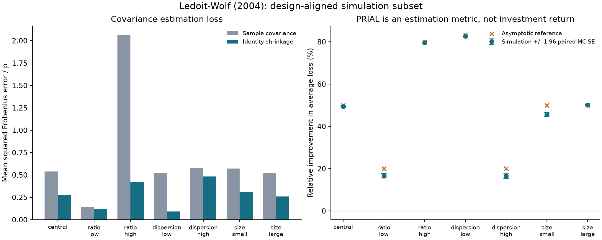

# Covariance Shrinkage Research

A small, auditable research project studying how scaled-identity covariance
shrinkage changes estimation error and matrix conditioning. It independently
implements **Ledoit and Wolf (2004), Equation (14)** and runs seven scenarios
aligned with part of the paper's Section 4 design.

**Scope:** a *design-aligned simulation subset*, not a complete paper replication
or an exact reconstruction of the authors' random draws. This project measures
covariance estimation loss, not portfolio returns or trading profitability.

[中文导读](docs/README.zh-CN.md) · [Methodology](docs/methodology.md) ·
[Acceptance protocol](docs/protocol.md) · [Committed results](results/reference/REPORT.md)



The recorded central run reduced covariance estimation loss from **0.538948**
to **0.272912**, a PRIAL of **49.362%** (Monte Carlo SE **0.242 percentage points**).
All seven configured scenarios passed their predeclared gates. The local
verification ran **42 tests** and built both distribution formats; remote CI
status is reported by GitHub separately. See [validation](docs/validation.md).

## What is here

- An independent NumPy estimator, with no scikit-learn dependency in the runtime.
- A nontrivial hand-calculated fixture, literal-formula checks and independent
  scikit-learn cross-checks, including more variables than observations.
- Seven fixed scenarios varying dimension/sample ratio, eigenvalue dispersion
  and sample scale, with 2,000 observation replications each.
- Paired Monte Carlo standard errors, analytic Gaussian risk checks, matrix
  invariants and condition-number diagnostics.
- All replication losses, realized population spectra, configuration hashes,
  software versions, a result table and a plot.
- Failure retention and CI: failed gates return a nonzero status without deleting
  results or choosing another seed.

## Run locally

Python 3.11 or newer. An ordinary CPU is sufficient; there is no GPU, paid data
platform, API key, account or network requirement after dependencies are installed.
All experimental observations are generated by the recorded protocol.

```bash
python3 -m venv .venv
source .venv/bin/activate
python -m pip install -e '.[test]'
python -m pytest
shrinkage-research --config configs/paper_subset.json --out work/my-first-run
```

Open `work/my-first-run/REPORT.md` and `loss_comparison.png`. The output directory
must be new or empty; subsequent runs should use a new directory. A module entry
point is also available:

```bash
python -m shrinkage_research.cli --config configs/paper_subset.json --out work/another-run
```

The package can be installed with `python -m pip install .` if only the experiment
runner is needed. Tests additionally install scikit-learn as an independent
numerical reference. `python -m build` builds the source and wheel distributions.
The Git repository carries configs and research outputs; the Python wheel is the
library and runner and takes an explicit config path.

## Scientific boundary

| Item | Published design | This repository |
|---|---|---|
| Observations | Gaussian, known zero mean | Same assumption; no demeaning; covariance divided by `n` |
| Central dimensions | `p=20`, `n=40` | Same |
| Population spectrum moments | Mean 1, dispersion 0.5 centrally | Enforced to numerical tolerance |
| Spectrum | Lognormal eigenvalues | Fixed seeded lognormal-shaped spectrum, explicit moment matching |
| Central simulation count | 1,000 | **2,000**, an explicit precision extension |
| Estimators | Several shrinkage estimators | Sample covariance and Eq. (14) only |
| Parameter study | Broader plotted sweeps | Seven selected scenarios, not every plotted point |

The paper does not provide the realized eigenvalue vector, seed or complete
spectrum-normalization algorithm. Our convention is fully specified and its
consequences are inspectable. Published central values are comparisons, not
acceptance targets; no seed was selected to match the table. The exact Gaussian
sample-risk identity supplies a separate quantitative benchmark.

The results describe the chosen Gaussian populations. They establish neither
robustness to market nonstationarity nor an investment advantage. Frobenius-loss
optimality does not imply optimal performance for every downstream use. The
estimator does not promise positive definiteness for all-zero or otherwise
degenerate observations. See [limitations](docs/methodology.md#limitations).

## Continue the research

Start with [the acceptance protocol](docs/protocol.md) and
[the next-experiment queue](docs/next-experiments.md). Add one predeclared question
at a time, keep unsuccessful results, and distinguish reproductions from new
extensions. The repository includes a manual runner and CI; it does **not** claim
that a scheduled research agent is already deployed.

AI assisted drafting, implementation and review; [AI assistance](docs/ai-assistance.md)
states what this does and does not demonstrate about personal ability.

## Sources and license

Ledoit, O. and Wolf, M. (2004). *A well-conditioned estimator for large-dimensional
covariance matrices*. Journal of Multivariate Analysis 88(2), 365–411.
[DOI](https://doi.org/10.1016/S0047-259X(03)00096-4) ·
[Author-hosted full text at UZH](https://www.econ.uzh.ch/dam/jcr:ffffffff-935a-b0d6-ffff-ffffceb83f14/wellCond.pdf).
Page/formula mapping and independent reference links are in
[sources](docs/sources.md). The paper is linked, not redistributed. Original code
and documentation in this repository are MIT licensed; this does not relicense
third-party papers or packages.
