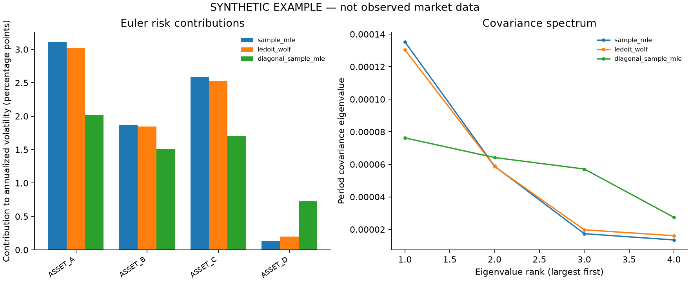

# Covariance Shrinkage Research · V2

A local browser workbench for understanding an existing portfolio's risk. Upload
returns or adjusted prices, set portfolio weights, compare three covariance
estimates, and check estimates against later observations. No API key, paid data
platform or cloud deployment is required. The original Ledoit–Wolf simulation
research remains available alongside the practical workflow.

[中文使用指南](docs/README.zh-CN.md) · [Risk methodology](docs/risk_methodology.md) ·
[V2 validation](docs/v2_validation.md) · [Changelog](CHANGELOG.md)

## Start in the browser

Python 3.11 or newer; an ordinary CPU is sufficient.

1. Clone this repository and install the browser extra:

   ```bash
   git clone https://github.com/zvzxh/covariance-shrinkage-research.git
   cd covariance-shrinkage-research
   python3 -m venv .venv
   source .venv/bin/activate
   python -m pip install -e '.[app]'
   ```

2. Start the local workbench:

   ```bash
   shrinkage-risk-ui
   ```

3. Open `http://127.0.0.1:8501`, try the synthetic example or upload a CSV, then
   click **开始分析**. Custom weights use numeric asset controls; no code or JSON
   editing is required. Stop the server with Ctrl-C in the terminal.

The launcher binds to `127.0.0.1` and disables Streamlit usage statistics. Uploads
are processed by your local Python process. The installed wheel also includes
the app and demo generator; the browser launcher does not depend on repository
working-directory files.

## Practical uses

- **Explain current portfolio risk:** compare annualized volatility and asset
  risk contributions under sample, Ledoit–Wolf and diagonal covariance estimates.
- **Check sensitivity:** change the estimation period or weights and inspect how
  conclusions depend on correlation, matrix conditioning and sample size.
- **Validate a risk estimate:** fit only past observations, then compare predicted
  variance with subsequent sample variance. This is a risk diagnostic, not a
  return forecast or a trading recommendation.
- **Reuse the data:** download the selected returns for the companion
  [Portfolio Walk-Forward Lab](https://github.com/zvzxh/portfolio-walkforward-lab).

**Synthetic example only:** the image below uses 125 generated return periods
and four fictional assets. It is not market evidence or investment performance.



## Your CSV

```csv
date,Asset_A,Asset_B
2025-01-02,0.01,-0.005
2025-01-03,-0.002,0.004
```

`0.01` means +1%; `1.0` means +100%. The first column must be `date` with unique,
strictly ascending ISO `YYYY-MM-DD` dates. Include at least two uniquely named
asset columns. Every value must be present and finite; simple returns must be
strictly greater than -1. Dates are period-end labels, and each row is one
observation period. Missing trading days are not inferred or filled.

For prices, select **复权价格** and provide strictly positive adjusted prices in
the same layout. The program cannot verify your vendor's adjustments. It validates
**all source rows**, calculates `price[t] / price[t-1] - 1` without filling, then
filters return-period-end dates and optionally keeps the last N returns. The
first price row is a baseline, not a zero return. The report records the original
baseline and the price date underlying the first selected return. At least two
returns must remain; prices therefore need at least three rows.

Inputs with duplicates, unsorted dates, missing cells or invalid values are
rejected. No silent sorting, imputation, renormalization or deletion occurs.

## Outputs and reuse

The browser downloads a self-contained HTML report, reusable configuration JSON,
selected returns CSV, and a ZIP with every covariance/correlation matrix, risk
contribution, eigenvalue, rolling validation record and provenance hash. The HTML
contains its own chart image and needs no network connection. Changing data,
filename or settings clears the previous result until you analyze again.

For an identical rerun, reuse the **original input** and downloaded configuration.
The selected returns export has already been converted and filtered; use it as a
new returns input when passing it to another tool.

The same workflow is available from the CLI:

```bash
shrinkage-risk --input my_returns.csv --config configs/risk_user.json --out work/my-risk-run
shrinkage-risk --input data/risk_demo_returns.csv --config configs/risk_demo.json --out work/demo-risk-run
```

For a saved browser configuration, replace `configs/risk_user.json` with that
file. `risk_user.json` labels the source as user supplied; `risk_demo.json` labels
it synthetic. The V2 output directory must **not exist**, including as an empty
directory. Creation is atomic, existing runs are never overwritten, and failures
retain a nonzero exit status with `failure.json` and an error manifest.

## Statistical boundaries

All three V2 covariance estimates subtract the observed mean and divide by `n`,
so comparisons do not mix sample denominators. Annualized volatility is
`sqrt(periods_per_year × period_variance)`; choose the factor for your row
frequency. This scaling assumes no serial covariance and does not measure it.

Euler contributions sum to portfolio volatility and may be negative. Zero
portfolio variance makes contribution percentages undefined. A singular matrix
can still give nonzero portfolio risk. Undefined correlations remain undefined.
The report records numerical rank, eigenvalues and conditioning warnings.

Rolling validation uses fixed portfolio exposures and strictly earlier training
rows. Future realized sample variance uses `ddof=1` and is a **noisy proxy**, not
known true covariance. It is not a holdings-drift backtest. Small and partial
validation blocks are particularly noisy; summary errors weight valid blocks
equally. Neither shrinkage nor a better result on this demo establishes future
investment performance. See [full definitions](docs/risk_methodology.md).

## Original research workflow remains available

V1 independently implements **Ledoit and Wolf (2004), Equation (14)** and runs
seven Section 4 design-aligned Gaussian simulation scenarios. It is a simulation
subset, not a complete paper replication or reconstruction of the authors'
random draws. Its observations have known zero mean; this differs deliberately
from the demeaned V2 analysis of user data.

```bash
shrinkage-research --config configs/paper_subset.json --out work/paper-rerun
```

The V1 CLI and committed reference experiment are preserved. Its existing rule
allows a new or empty output directory. Read the original [methodology](docs/methodology.md),
[acceptance protocol](docs/protocol.md), [reference report](results/reference/REPORT.md)
and [V1 validation](docs/validation.md). The recorded central simulation has
PRIAL 49.362% (Monte Carlo SE 0.242 percentage points); this measures covariance
estimation loss under that simulation, not investment returns.

## Development and attribution

```bash
python -m pip install -e '.[app,test]'
python -m pytest
python -m build
```

CI has a dedicated browser test job that installs Streamlit, in addition to the
core Python matrix. The source distribution includes example CSVs/configurations;
the wheel contains the library, runners and browser app. No scheduler or autonomous
research agent is deployed. AI assisted implementation and review; the
[AI assistance statement](docs/ai-assistance.md) distinguishes tested software
from claims about the owner's personal understanding or unaided authorship.

Ledoit, O. and Wolf, M. (2004). *A well-conditioned estimator for large-dimensional
covariance matrices*. Journal of Multivariate Analysis 88(2), 365–411.
[DOI](https://doi.org/10.1016/S0047-259X(03)00096-4) ·
[Author-hosted full text](https://www.econ.uzh.ch/dam/jcr:ffffffff-935a-b0d6-ffff-ffffceb83f14/wellCond.pdf).
See [source mapping](docs/sources.md). Original code and documentation are MIT
licensed; third-party papers and dependencies retain their own licenses.
